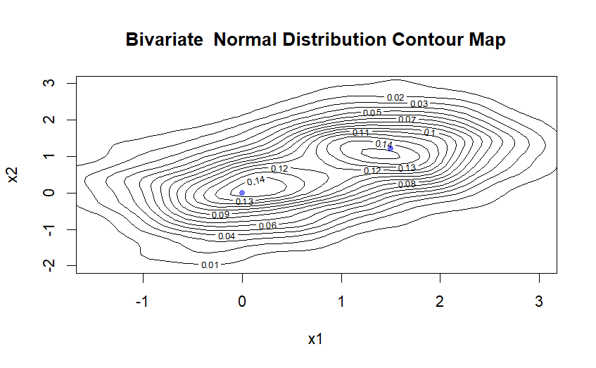

# Collaborations

Nisal Amashan: Responsible for the question 1.

Cui Qingxuan: Responsible for the question 2.

# Question 1

## Rejection Sampling

```{r echo=FALSE}

# Function to measure execution time
measure_time = function(expr) {
  start_time = Sys.time()
  result = eval(expr)
  end_time = Sys.time()
  time_taken = end_time - start_time
  return(list(result = result, time = time_taken))
}

target <- function(x) {
  return(ifelse(x < -1 | x > 1, 0, 
                ifelse(x >= -1 & x <= 0, x + 1, 
                       ifelse(x > 0 & x <= 1, 1 - x, NA))))
}

proposal <- function(x) {
  return(0.5)
}

rejection_sampling <- function(N) {
  set.seed(123)
  M = 2
  samples = numeric(N)
  count = 0
  total_random_values = 0  # Track the number of random variables used
  
  while (count < N) {
    sample = runif(1, -1, 1)  # Proposal sample
    un = runif(1)  # Uniform(0,1) for acceptance
    total_random_values = total_random_values + 2  # 2 per iteration
    
    if (un <= target(sample) / (M * proposal(sample))) {
      count = count + 1
      samples[count] = sample
    }
  }
  
  return(list(samples = samples, total_random_values = total_random_values))
}

# Measure execution time
rej_results = measure_time(quote(rejection_sampling(10000)))
samples_a = rej_results$result$samples
time_a = rej_results$time
random_values_a = rej_results$result$total_random_values

# Plot histogram
hist(samples_a, probability = TRUE, breaks = 50, col="lightblue",
     main="Rejection Sampling", xlab="x", ylim=c(0,2))

curve(ifelse(x < 0, x + 1, 1 - x), from = -1, to = 1, col="red", lwd=2, add=TRUE)

```

## Composition Sampling

```{r echo=FALSE}
set.seed(123)
generate_Y <- function(N) {
  u = runif(N)  # Generate uniform(0,1) random numbers
  return(1 - sqrt(1 - u))  # Apply inverse CDF transformation
}

generate_X_composition <- function(N) {
  Y = generate_Y(N)  # Generate Y in [0,1]
  sign = ifelse(runif(N) < 0.5, -1, 1)  # Assign -1 or 1 with equal probability
  X = sign * Y  # Flip sign to get X in [-1,1]
  
  total_random_values = 2 * N  # 2 random values per sample
  return(list(samples = X, total_random_values = total_random_values))
}
set.seed(123)
# Measure execution time
comp_results = measure_time(quote(generate_X_composition(10000)))
samples_b = comp_results$result$samples
time_b = comp_results$time
random_values_b = comp_results$result$total_random_values

# Plot histogram
hist(samples_b, probability = TRUE, breaks = 50, col="lightblue",
     main="Composition Sampling", xlab="x", ylim=c(0,2))

curve(ifelse(x < 0, x + 1, 1 - x), from = -1, to = 1, col="red", lwd=2, add=TRUE)

```


## Triangle Distribution via Uniform Differences

```{r echo=FALSE}
set.seed(123)
generate_X_uniform <- function(N) {
  U1 = runif(N)  # Generate first uniform sample
  U2 = runif(N)  # Generate second uniform sample
  X = U1 - U2    # Compute the difference
  
  total_random_values = 2 * N  # 2 random values per sample
  return(list(samples = X, total_random_values = total_random_values))
}
set.seed(123)
# Measure execution time
uni_results = measure_time(quote(generate_X_uniform(10000)))
samples_c = uni_results$result$samples
time_c = uni_results$time
random_values_c = uni_results$result$total_random_values

# Plot histogram
hist(samples_c, probability = TRUE, breaks = 50, col="lightblue",
     main="Uniform Difference Sampling", xlab="x", ylim=c(0,2))

curve(ifelse(x < 0, x + 1, 1 - x), from = -1, to = 1, col="red", lwd=2, add=TRUE)


```


## Computational Summary


```{r, echo=FALSE, include=TRUE}
cat("Rejection Sampling:\n")
cat("Execution Time:", time_a, "seconds\n")
cat("Random Variables Generated:", random_values_a, "\n\n")

cat("Composition Sampling:\n")
cat("Execution Time:", time_b, "seconds\n")
cat("Random Variables Generated:", random_values_b, "\n\n")

cat("Uniform Difference Sampling:\n")
cat("Execution Time:", time_c, "seconds\n")
cat("Random Variables Generated:", random_values_c, "\n")
```


### Computational Summary

| Method                     | Execution Time (seconds) | Random Variables Generated |
|----------------------------|-------------------------|----------------------------|
| **Rejection Sampling**     | `r time_a`             | `r random_values_a`        |
| **Composition Sampling**   | `r time_b`             | `r random_values_b`        |
| **Uniform Difference Sampling** | `r time_c`       | `r random_values_c`        |

### Observations
- **Rejection Sampling** is the slowest due to high rejection rates.
- **Composition Sampling** is efficient with a fixed number of uniform draws.
- **Uniform Difference Sampling** is the fastest.

### Preferred Method
Uniform Difference Sampling is preferred due to its speed and computational simplicity.

### Variance Estimation
```{r}
variance_X = var(samples_c)
cat("Variance of X (Uniform Difference Sampling):", variance_X, "\n")
```


# Question 2

## Generate a Random Vector using the 2 Methods

### Box-Muller Method

**Measure the time for generating 10 000 000 numbers:**

```{r, echo=FALSE}
normRVgen = function(n, mu, sigma){
  # create 2 rv vector uniformly distribute
  # u1 represents R
  # u2 represents angle
  u1 = runif(n, min=0, max=1)
  u2 = 2*pi*runif(n, min=0, max=1)
  
  # Generate X=[x1, x2] ~ N(0,1)
  x1 = sqrt(-2*log(u1))*cos(u2)
  x2 = sqrt(-2*log(u1))*sin(u2)
  x = rbind(x1, x2)
  # Transform to Z via Z = A.T @ X + mu
  # Cholesky Decomposition -> get A from Sigma = A.T@A
  At = t(chol(sigma))
  Z = At %*% x + mu 
  
  return (Z)
}

n =  10000000
mu = c(0,0)
sigma = matrix(c(0.6,0,0,0.6), nrow=2)
start = proc.time()
rv = normRVgen(n,mu,sigma)
end = proc.time()
print(end - start)
```
### Package mvtnorm
**The reason I use it:**

For generating correlated multivariate normal vectors at scale, mvtnorm provides a streamlined, efficient, and statistically rigorous solution. It eliminates manual matrix operations, ensures correctness, and scales effortlessly to large datasets—making it the optimal choice for this task.

**Measure the time for generating 10 000 000 numbers:**

```{r, warning=FALSE, echo=FALSE}
library(mvtnorm)
start = proc.time()
rv_buildin <- rmvnorm(n, mean = mu, sigma = sigma)
end = proc.time()
print(end-start)
```

### Compare the Time of 2 Methods

Box-Muller method takes roughly 50% more time than mvnorm package to generate a random variable.

## Generate the Random Vectors from 2 Distributions

```{r, include=FALSE}
# Generate 500 values for each distribution
n = 500
rv_d1 = normRVgen(n, mu, sigma)

mu_d2 = c(1.5, 1.2)
sigma_d2 = matrix(c(0.5,0,0,0.5), nrow=2)
rv_d2 = normRVgen(n, mu_d2, sigma_d2)
# Bind them and shuffle
rv_mix = as.data.frame(t(cbind(rv_d1, rv_d2)))
set.seed(123)
rv_shuffled = rv_mix[sample(nrow(rv_mix)), ]
colnames(rv_shuffled) = c("x1", "x2")

```

### Plot the Random Variables

```{r, echo=FALSE, out.width="90%", echo=FALSE}


```

### Discussion

It looks satisfactory.

Based on the contour map, we can see the contour lines in the graph are inclined ellipses, and the interval between contour lines becomes progressively wider as the height increases, and is symmetrical about the mean point (the blue point), which in summary is consistent with the properties of a Bivariate Normal Distribution image.


# Appendix

## Question 1

```{r, eval=FALSE}
# Function to measure execution time
measure_time = function(expr) {
  start_time = Sys.time()
  result = eval(expr)
  end_time = Sys.time()
  time_taken = end_time - start_time
  return(list(result = result, time = time_taken))
}


# (a) Rejection Sampling Method 

target <- function(x) {
  return(ifelse(x < -1 | x > 1, 0, 
                ifelse(x >= -1 & x <= 0, x + 1, 
                       ifelse(x > 0 & x <= 1, 1 - x, NA))))
}

proposal <- function(x) {
  return(0.5)
}

rejection_sampling <- function(N) {
  M = 2
  samples = numeric(N)
  count = 0
  total_random_values = 0  # Track the number of random variables used
  
  while (count < N) {
    sample = runif(1, -1, 1)  # Proposal sample
    un = runif(1)  # Uniform(0,1) for acceptance
    total_random_values = total_random_values + 2  # 2 per iteration
    
    if (un <= target(sample) / (M * proposal(sample))) {
      count = count + 1
      samples[count] = sample
    }
  }
  
  return(list(samples = samples, total_random_values = total_random_values))
}

# Measure execution time
rej_results = measure_time(quote(rejection_sampling(10000)))
samples_a = rej_results$result$samples
time_a = rej_results$time
random_values_a = rej_results$result$total_random_values

# Plot histogram
hist(samples_a, probability = TRUE, breaks = 50, col="lightblue",
     main="Rejection Sampling", xlab="x", ylim=c(0,2))

curve(ifelse(x < 0, x + 1, 1 - x), from = -1, to = 1, col="red", lwd=2, add=TRUE)


# (b) Composition Sampling Method 


generate_Y <- function(N) {
  u = runif(N)  # Generate uniform(0,1) random numbers
  return(1 - sqrt(1 - u))  # Apply inverse CDF transformation
}

generate_X_composition <- function(N) {
  Y = generate_Y(N)  # Generate Y in [0,1]
  sign = ifelse(runif(N) < 0.5, -1, 1)  # Assign -1 or 1 with equal probability
  X = sign * Y  # Flip sign to get X in [-1,1]
  
  total_random_values = 2 * N  # 2 random values per sample
  return(list(samples = X, total_random_values = total_random_values))
}

# Measure execution time
comp_results = measure_time(quote(generate_X_composition(10000)))
samples_b = comp_results$result$samples
time_b = comp_results$time
random_values_b = comp_results$result$total_random_values

# Plot histogram
hist(samples_b, probability = TRUE, breaks = 50, col="lightblue",
     main="Composition Sampling", xlab="x", ylim=c(0,2))

curve(ifelse(x < 0, x + 1, 1 - x), from = -1, to = 1, col="red", lwd=2, add=TRUE)


# (c) Uniform Difference Method 


generate_X_uniform <- function(N) {
  U1 = runif(N)  # Generate first uniform sample
  U2 = runif(N)  # Generate second uniform sample
  X = U1 - U2    # Compute the difference
  
  total_random_values = 2 * N  # 2 random values per sample
  return(list(samples = X, total_random_values = total_random_values))
}

# Measure execution time
uni_results = measure_time(quote(generate_X_uniform(10000)))
samples_c = uni_results$result$samples
time_c = uni_results$time
random_values_c = uni_results$result$total_random_values

# Plot histogram
hist(samples_c, probability = TRUE, breaks = 50, col="lightblue",
     main="Uniform Difference Sampling", xlab="x", ylim=c(0,2))

curve(ifelse(x < 0, x + 1, 1 - x), from = -1, to = 1, col="red", lwd=2, add=TRUE)


# Print Computational Summary 
cat("\n=== Computational Summary ===\n")
cat("Rejection Sampling:\n")
cat("Execution Time:", time_a, "seconds\n")
cat("Random Variables Generated:", random_values_a, "\n\n")

cat("Composition Sampling:\n")
cat("Execution Time:", time_b, "seconds\n")
cat("Random Variables Generated:", random_values_b, "\n\n")

cat("Uniform Difference Sampling:\n")
cat("Execution Time:", time_c, "seconds\n")
cat("Random Variables Generated:", random_values_c, "\n")


```

## Question 2

```{r, eval=FALSE}
normRVgen = function(n, mu, sigma){
  # create 2 rv vector uniformly distribute
  # u1 represents R
  # u2 represents angle
  u1 = runif(n, min=0, max=1)
  u2 = 2*pi*runif(n, min=0, max=1)
  
  # Generate X=[x1, x2] ~ N(0,1)
  x1 = sqrt(-2*log(u1))*cos(u2)
  x2 = sqrt(-2*log(u1))*sin(u2)
  x = rbind(x1, x2)
  # Transform to Z via Z = A.T @ X + mu
  # Cholesky Decomposition -> get A from Sigma = A.T@A
  At = t(chol(sigma))
  Z = At %*% x + mu 
  
  return (Z)
}

n =  1000
mu = c(0,0)
sigma = matrix(c(0.6,0,0,0.6), nrow=2)
start = proc.time()
rv = normRVgen(n,mu,sigma)
end = proc.time()
print(end - start)

library(mvtnorm)
start = proc.time()
rv_buildin <- rmvnorm(n, mean = mu, sigma = sigma)
end = proc.time()
print(end-start)

# Generate 500 values for each distribution
n = 500
rv_d1 = normRVgen(n, mu, sigma)

mu_d2 = c(1.5, 1.2)
sigma_d2 = matrix(c(0.5,0,0,0.5), nrow=2)
rv_d2 = normRVgen(n, mu_d2, sigma_d2)
# Bind them and shuffle
rv_mix = as.data.frame(t(cbind(rv_d1, rv_d2)))
set.seed(123)
rv_shuffled = rv_mix[sample(nrow(rv_mix)), ]
colnames(rv_shuffled) = c("x1", "x2")

# Generate 500 values for each distribution
n = 500
rv_d1 = normRVgen(n, mu, sigma)

mu_d2 = c(1.5, 1.2)
sigma_d2 = matrix(c(0.5,0,0,0.5), nrow=2)
rv_d2 = normRVgen(n, mu_d2, sigma_d2)
# Bind them and shuffle
rv_mix = as.data.frame(t(cbind(rv_d1, rv_d2)))
set.seed(123)
rv_shuffled = rv_mix[sample(nrow(rv_mix)), ]
colnames(rv_shuffled) = c("x1", "x2")

# Plot the Function
library(MASS)
z <- kde2d(rv_shuffled$x1, rv_shuffled$x2, n = 50)
contour(z, xlab = "x1", ylab = "x2", main = "Binary Normal Distribution Contour Map")
# points(rv_shuffled$x1, rv_shuffled$x2, col = rgb(0, 0, 1, 0.5), pch = 19,cex = 0.3)
```